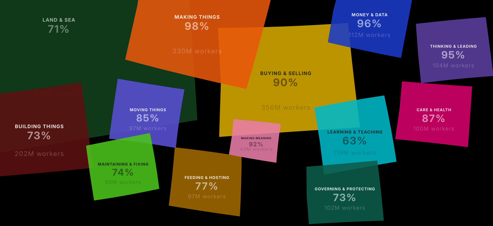

# Large Labor Model

[](https://largelabormodel.com)
[](./ai_reach_v5.0.json)
[](./LICENSE)
[](./LICENSE)

An interactive research and art project mapping AI's technical capability to replace human labor — from the first point at which global employment can be measured to the furthest point at which it can be reasonably projected.

**[largelabormodel.com](https://largelabormodel.com)**

Created by Lukas Seel and Enya Trenholm-Jensen. Open source. April 2026.



---

## What it is

The Large Labor Model traces human labor across **15 territories of work** (13 modern + 2 historical aggregates) from 1800 to 2041. It maps two things:

**Labor shares** — how many people work in each territory, globally, based on ILO data and historical reconstructions.

**Replaceability** — when AI or robotics becomes technically capable of performing each territory's core tasks, scored 0–100 based on what is commercially available at the frontier.

The gap between what AI *can* do and what has actually changed in the labor market is the project's central provocation. A territory can score 90 while employment barely moves. That is not a flaw — it is the most important thing the visualization shows.

This is a model, not a prediction. Every number is an invitation to engage, refine, and challenge.

---

## The core distinction

**Replaceability** = can the best commercially available AI/robotics perform this role? Pure technical capability. Lab prototypes don't count. Deployment rates, economics, regulation, and social preference are recorded as barrier annotations — they do not suppress the score. *This is what the model measures.*

**Replacement** = when workers actually lose jobs. Lags replaceability by months to decades. *This is what labor share data tracks.*

---

## The 13 territories

| Territory | ISIC | What it covers |
|---|---|---|
| Land & Sea | A, B | Agriculture, forestry, fishing, mining |
| Making Things | C | Manufacturing |
| Building Things | F | Construction |
| Moving Things | H | Transport, logistics, warehousing |
| Buying & Selling | G | Retail and wholesale trade |
| Money & Data | J, K, L | Finance, insurance, information, real estate |
| Care & Health | Q | Human health and social work, personal care |
| Learning & Teaching | P | Education |
| Making Meaning | R | Arts, media, creative industries |
| Governing & Protecting | O | Public administration, defense |
| Feeding & Hosting | I | Accommodation, food service |
| Maintaining & Fixing | D, E, S | Utilities, repair, personal services |
| Thinking & Leading | M, N | Management, consulting, science, professional strategy |

Plus **2 historical aggregate territories** (Industry and Services) that cover the period before granular sectoral data was available — they disaggregate progressively into the 13 modern territories between 1900 and 1980.

### Editorial principles

Two principles shape how occupations are placed into territories:

1. **Nature of work, not industry sector.** A barber's work is personal care, so barbers belong to Care & Health regardless of whether they work in a salon (retail) or a hotel (hospitality). A car mechanic's work is repair, so mechanics belong to Maintaining & Fixing regardless of whether they work for a manufacturer or a dealership.

2. **Functional managers go with their function.** A Finance Manager belongs to Money & Data, not Thinking & Leading. Thinking & Leading is reserved for organizational generalists (Chief Executives, Management Consultants), pure knowledge workers (Mathematicians, Sociologists, Humanities Academics), and people functions (HR Specialists, Development Officers).

---

## Dataset

**Current version:** 5.0 (April 2026) — a ground-up rebuild with task decomposition, empirically-calibrated replacement formula, and editorially-reviewed moderate scenario. See [`docs/v5_changelog.md`](./docs/v5_changelog.md), [`docs/v5_methodology.md`](./docs/v5_methodology.md), and [`docs/v5_editorial_process.md`](./docs/v5_editorial_process.md). v3.2 remains in [`archive/`](./archive/) for lineage.

| Layer | Records | Coverage |
|---|---|---|
| Labor shares | 635 | 1800–2041 |
| Replaceability scores (territory-level) | 936 | 1970–2041 (585 historical 1970–2014 + 351 modern 2015–2041) |
| Occupations (per-occupation scores) | 480 | ISCO-08 4-digit + 9 specialized splits, searchable |
| Tasks (per-occupation task decomposition) | 4,818 | 2–14 tasks per occupation, 6-vector classified with difficulty + time weight |
| Displayed occupations (canvas) | 104 | 8 per modern territory |
| Technology events | 77 | 1764–2026 |
| Historical occupations | 24 | 8 per historical aggregate (3 categories) |
| Sources | 6,687 | Per-record citation |

**Source architecture:**
- **ILOSTAT** modeled estimates (1991–2025, primary modern labor)
- **World Bank / IISS Military Balance** (1988–2025, Governing & Protecting)
- **GGDC 10-Sector Database** (1870–1991, splice-adjusted to ILOSTAT classification at 1991)
- **Bairoch, Maddison, Mitchell** (pre-1870 reconstructions)
- **O\*NET + BLS OES/OOH + live LinkedIn scrapes** (task decompositions + common titles)
- **IFR World Robotics 2025** (P_A calibration)
- **METR, Epoch AI, SWE-bench, GPQA, HLE, ARC-AGI-3** (benchmark calibration landscape)
- **Anthropic Economic Index** (Massenkoff & McCrory, March 2026 — cross-section for Phase 6 / 11 calibration)
- **Waymo + humanoid pilots** (Figure at BMW, Tesla Optimus, Amazon Vulcan — deployment ground truth)

### Replaceability scoring

- Every occupation decomposed into tasks, each tagged with a **capability vector** (one of six: C_R routine cognitive, C_G generative cognitive, P_A physical automation, Phi_S selective physical, Phi_U unstructured physical, S_E system engineering), a difficulty threshold, and a time weight.
- 2026 capability values (C_R=0.76, C_G=0.57, P_A=0.75, Phi_S=0.46, Phi_U=0.15, S_E=0.35) set by **two independent recalibration instances** under an honest deployment lens (benchmark-saturation ≠ deployment maturity). Tight convergence between Opus 4.7 and GPT-5.4.
- 1970 → 2041 trajectory: two parallel forecasters + reconciler at each end — **Phase 7** forward (2026 → 2041), **Phase 12** backward (1970 → 2025). Reconciled under `mid = min(A_mid, B_mid)` to prevent any single instance's aggressiveness from pulling the central case.
- Per-occupation barrier tags: **REGULATORY / ECONOMIC / HUMANOID_DEPENDENT / HUMAN_PREFERENCE / NONE**. Regulatory and preference barriers live in the replacement formula, not in the replaceability score itself.

### Projection (2027–2041)

The visualization shows a single projection under the moderate capability trajectory. The displacement model converts capability gains into projected workforce reduction using an empirically-calibrated conversion rate (0.30) and a 15-year lag schedule (7/18/30/42/44% absorption) fit against seven historical automation cases and the Anthropic Economic Index cross-section. Low and high scenario bands are preserved per-occupation as structural metadata but are not yet editorially reviewed — v5.0 ships moderate only. See [`docs/v5_methodology.md`](./docs/v5_methodology.md) for parameters, assumptions, and the full honest-limitations inventory.

---

## How it works

The visualization is a single `index.html` loading a single JSON dataset. No build step, no framework, no dependencies. Canvas-rendered. Deployed on Vercel.

### Run locally

```bash
git clone https://github.com/lamentierschweinchen/ai-reach.git
cd ai-reach
python3 -m http.server 8000
# Visit http://localhost:8000
```

### File layout

```
ai-reach/
├── index.html                    # Main visualization (~2,700 lines, canvas + DOM)
├── methodology.html              # Short methodology page (linked from the site)
├── methodology-full.html         # Full methodology + changelog
├── ai_reach_v5.0.json            # Current dataset (the only file index.html fetches)
├── DATA_ARCHITECTURE.md          # Schema and rendering pipeline reference
├── LICENSE                       # MIT (code) + CC BY 4.0 (data)
├── CONTRIBUTING.md               # How to propose corrections and additions
├── CITATION.cff                  # Citation metadata
├── docs/
│   ├── hero-2041.png             # Repo hero image
│   ├── v5_changelog.md           # Full v5 changelog (primary reference)
│   ├── v5_methodology.md         # Full v5 methodology (markdown source for methodology-full.html)
│   └── v5_editorial_process.md   # Build journey + Phase 11/12 interventions (post-mortem)
├── archive/                      # Historical dataset versions
│   ├── ai_reach_v3.0.json
│   ├── ai_reach_v3.1.json
│   ├── ai_reach_v3.2.json
│   └── README.md
├── fonts/Inter-Variable.ttf
└── favicon.svg
```

---

## Contributing

Open source by design. Specific, evidence-backed corrections are exactly what we want. See [**CONTRIBUTING.md**](./CONTRIBUTING.md) for the full guide.

The short version:

- **Score correction**: Open an issue using the *Score correction* template. Include territory, year, current score, proposed score, and a link to the commercially available product or deployment that supports the change.
- **Bug report**: Use the *Bug report* template.
- **Methodology critique**: Open a discussion or an issue. Read [`methodology-full.html`](./methodology-full.html) first — most of the model's assumptions are documented there with notes on which are most worth challenging.

The standard for evidence is **commercial availability**, not lab demos. A research paper showing 95% accuracy on a benchmark does not raise a score. A product you can buy — or a documented deployment — does.

---

## Citation

```
Seel, L. & Trenholm-Jensen, E. (2026). Large Labor Model (v5.0) [Dataset].
https://largelabormodel.com
```

GitHub auto-generates a "Cite this repository" widget from [`CITATION.cff`](./CITATION.cff).

---

## License

- **Code** (`index.html`, `methodology.html`, `methodology-full.html`, all JavaScript): [MIT](./LICENSE)
- **Data** (`ai_reach_v5.0.json` and successor versions, methodology content): [CC BY 4.0](./LICENSE)
- **Inter typeface**: SIL Open Font License 1.1

You are free to share, adapt, and build on the dataset for any purpose, commercial or otherwise, with attribution.

---

*Large Labor Model is grounded in early 2026 — a moment when AI capabilities have made extraordinary leaps that most research has not yet caught up with. Helping the model catch up is the work.*
